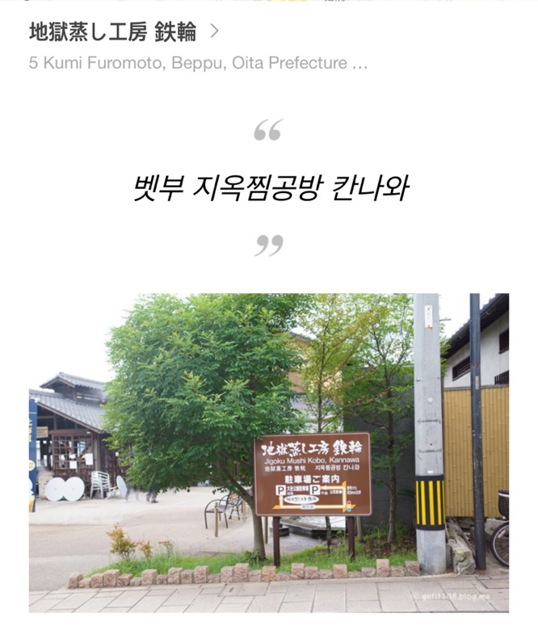
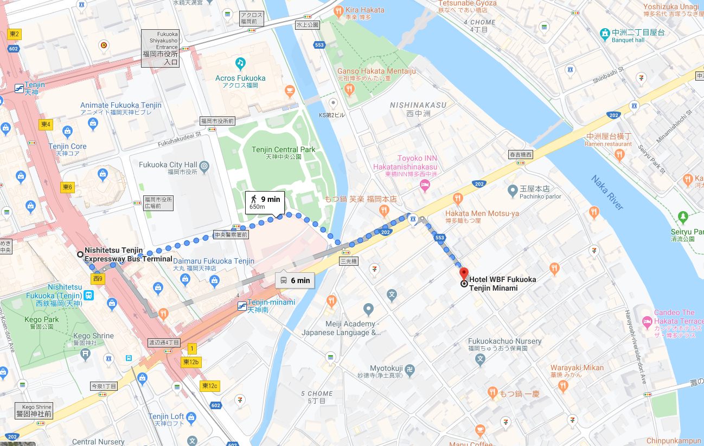

# Fukuoka Vacation Plan

## Itenerary
### Day 1

* 08.00  : Depart from house
* 10.00  : Reach Incheon Airport 
* 12.00  : Depart from Incheon to Hataka Airport, Japan
* 14:00  : Estimated reach time
* 15:38  : Take bus to Yufuin
* 17:15  : Reach Yufuin Station
* 17:30  : Visit Yunotsubo Street
* 18:10  : Travel to Musouen Ryokan
* 18:45  : Reach Musouen Ryokan 
* 19:00  : Makan kaeseki
* 20:00  : Enjoy hot spring

### Day 2

* 07:00  : Wakie wakie
* 08:00  : Breakie Breakie
* 09:00  : check out , Travel to Yunotsubo Street
* 09:30  : Play around Yunotsubo Street
* 10:30  : Floral Village
* 11:00  : Kinrin Lake
* 12:00  : Lunch at Yunotsubo Street.
* 14:30  : Travel to Beppu
  

* 15:30  : Reach Sea Hell
  
  

* 17:00  : Hell Food Finding

  

* 19:10 : Bus to back to Fukuoka

* 21:30 : Reach Tenshin Bus Station
  
  
  
* 22:00 : Food Hunting at Nakasu Area  
  

### Day 3
* 08:00 : Breakie Breakie
* 09:00 : Fukuoka Central Post Office
* 09:30 : Tenjin Central Park
* 11:30 : Ohori Park
* 13:00 : Canal City
* 13:30 : Lunch+Dessert at Canal City
* 15:00 : Hanging Around Tenjin Area
* 17:30 : Heading to airport
  

## Foods
## Things to do
